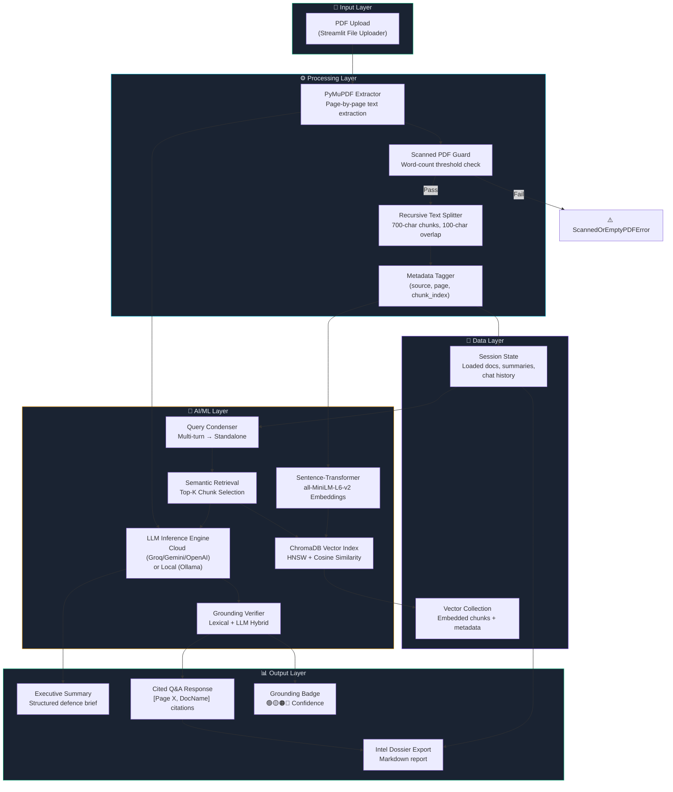

<div align="center">

# 🛡️ ASTRA INTEL

### AI-Powered Defence Document Intelligence System

*Ingest classified PDFs → Generate executive intelligence summaries → Query with verified, citation-backed answers*

[](https://python.org)
[](https://streamlit.io)
[](https://www.trychroma.com/)
[](LICENSE)

</div>

---

## 📋 Table of Contents

1. [Project Overview](#-project-overview)
2. [Features](#-features)
3. [Tech Stack](#-tech-stack)
4. [System Architecture](#-system-architecture)
5. [Setup & Quickstart](#-setup--quickstart)
6. [AI/ML Technical Rationale](#-aiml-technical-rationale)
7. [Testing & Edge Cases](#-testing--edge-cases)
8. [Limitations & Future Improvements](#-limitations--future-improvements)
9. [AI Usage Disclosure](#-ai-usage-disclosure)

---

## 🎯 Project Overview

### Problem Statement

Defence organisations manage vast repositories of classified technical documents — threat assessments, equipment specifications, doctrine manuals, and intelligence reports. Analysts must rapidly extract actionable intelligence from these dense PDFs under operational time pressure. Manual review is error-prone, slow, and does not scale.

### What ASTRA INTEL Does

**ASTRA INTEL** is a Retrieval-Augmented Generation (RAG) system that transforms unstructured defence PDFs into queryable intelligence. It:

1. **Ingests** multi-page technical PDFs with page-level text extraction and scanned-document detection.
2. **Chunks and embeds** text using semantic-aware recursive splitting that preserves document page boundaries.
3. **Indexes** chunks in a local vector database with source metadata (filename, page number, chunk position).
4. **Generates executive summaries** formatted as structured defence intelligence briefs.
5. **Answers analyst queries** with inline `[Page X, DocName]` citations and anti-hallucination grounding verification.
6. **Supports multi-document workspaces** — upload several PDFs and run comparative cross-document analysis.
7. **Operates in Cloud or Air-Gapped mode** — switch between cloud LLMs (Groq / Gemini / OpenAI) and fully offline local inference via Ollama.

### Core Objective

Deliver a functional, defence-focused document intelligence tool that demonstrates strong RAG engineering: deterministic page-level citations, anti-hallucination guardrails, and multi-document retrieval — not just a chatbot wrapper over an LLM.

---

## ✨ Features

### Must Have ✅

| Feature | Status | Details |
|---------|--------|---------|
| PDF text extraction with metadata | ✅ Done | PyMuPDF-based extraction with per-page text, character counts, and scanned-PDF detection |
| Semantic chunking with page tracking | ✅ Done | Recursive text splitter (paragraph → sentence → word fallback) preserving `(source, page, chunk_index)` metadata |
| Vector embedding & retrieval | ✅ Done | `all-MiniLM-L6-v2` sentence-transformer embeddings indexed in ChromaDB with cosine similarity |
| Executive summary generation | ✅ Done | Structured defence intelligence brief with objectives, specs, constraints sections |
| Grounded Q&A with citations | ✅ Done | Inline `[Page X]` / `[Page X, DocName]` citations mapped back to source chunks |
| Anti-hallucination guardrails | ✅ Done | Hybrid lexical (n-gram overlap) + LLM-based verification producing grounding confidence badges |
| Streamlit UI | ✅ Done | Tactical dark theme with real-time processing feedback, chat interface, and citation display |

### Should Have ✅

| Feature | Status | Details |
|---------|--------|---------|
| Multi-document workspace | ✅ Done | Upload multiple PDFs simultaneously; each is tracked independently with metadata |
| Multi-turn conversational Q&A | ✅ Done | Context-aware query condenser rewrites follow-up questions into standalone queries |
| Cross-document comparative analysis | ✅ Done | Per-document chunk retrieval with structured comparison engine |
| Cloud / Air-Gapped mode toggle | ✅ Done | Runtime switch between cloud APIs (Groq/Gemini/OpenAI) and local Ollama inference |
| Intel Dossier export | ✅ Done | Downloadable Markdown report with summaries, Q&A transcript, grounding scores, and audit trail |

### Bonus ✅

| Feature | Status | Details |
|---------|--------|---------|
| Grounding verification badges | ✅ Done | 🟢 High / 🟡 Medium / 🟠 Low / 🔴 Ungrounded visual badges with flagged-claim drill-down |
| Scanned/image-only PDF detection | ✅ Done | Word-count threshold guard with actionable error messages |
| Multi-provider cloud fallback | ✅ Done | Auto-detection priority: Groq → Gemini → OpenAI based on available API keys |
| Automated test suite | ✅ Done | 20+ pytest cases covering ingestion, corruption, hallucination, and citation accuracy |

---

## 🔧 Tech Stack

| Layer | Technology | Purpose |
|-------|-----------|---------|
| **Language** | Python 3.10+ | Core application language |
| **UI Framework** | Streamlit ≥1.36 | Interactive web interface with real-time session state |
| **PDF Extraction** | PyMuPDF (pymupdf) ≥1.24 | Text extraction with page-level granularity |
| **Embedding Model** | `all-MiniLM-L6-v2` (Sentence Transformers) | 384-dim dense embeddings, runs locally, no API required |
| **Vector Store** | ChromaDB ≥0.5 (Ephemeral Client) | In-memory HNSW index with cosine similarity and metadata filtering |
| **Cloud LLMs** | Groq (LLaMA 3.1 70B), Google Gemini 2.0 Flash, OpenAI GPT-4o-mini | Inference for summary generation, Q&A, and grounding verification |
| **Local LLM** | Ollama (LLaMA 3.2 / Mistral / Qwen 2.5) | Air-gapped inference — no data leaves the machine |
| **Environment** | python-dotenv | Secure API key management via `.env` files |
| **HTTP** | Requests | REST API calls to Groq, Gemini, OpenAI, and Ollama endpoints |
| **Testing** | pytest | Automated pipeline validation |

---

## 🏗️ System Architecture



### Data Flow Narrative

1. **Input**: The analyst uploads one or more PDF documents via the Streamlit sidebar.
2. **Extraction**: PyMuPDF extracts text page-by-page. A word-count guard rejects scanned/image-only PDFs that lack extractable text.
3. **Chunking**: A recursive text splitter breaks each page's text into ~700-character chunks with 100-character overlap, attempting natural boundaries (paragraph → sentence → word). Each chunk retains `(source_filename, page_number, chunk_index)` metadata.
4. **Embedding**: The `all-MiniLM-L6-v2` sentence-transformer model generates 384-dimensional dense vectors for each chunk. This runs entirely locally — no API call required.
5. **Indexing**: Vectors are stored in a ChromaDB ephemeral collection using HNSW indexing with cosine distance. Metadata filters enable per-document and cross-document retrieval.
6. **Query Processing**: When the analyst asks a question, a query condenser rewrites follow-up questions into standalone queries using the conversation history. The standalone query is embedded and used for top-K similarity search.
7. **Generation**: Retrieved context chunks are injected into a defence-grade system prompt. The LLM generates an answer using ONLY the provided context, with strict instructions to include `[Page X, DocName]` inline citations.
8. **Verification**: The answer passes through a hybrid grounding verifier — a fast lexical check (keyword + bigram + 4-gram overlap) followed by an optional LLM semantic check for borderline scores. The result is a confidence badge (🟢 🟡 🟠 🔴) displayed alongside the answer.
9. **Export**: The analyst can export a complete Intel Dossier as a Markdown file containing document inventory, summaries, Q&A transcript, grounding scores, and an audit trail.

---

## 🚀 Setup & Quickstart

### Prerequisites

- **Python 3.10+** installed
- **pip** package manager
- **(Optional)** [Ollama](https://ollama.ai) installed for air-gapped local inference

### Installation

```bash
# 1. Clone the repository
git clone https://github.com/YOUR_USERNAME/astra-intel.git
cd astra-intel/astra_intel

# 2. Create and activate a virtual environment
python -m venv venv
source venv/bin/activate        # macOS / Linux
# venv\Scripts\activate         # Windows

# 3. Install dependencies
pip install -r requirements.txt

# 4. Configure environment variables
cp .env.example .env
# Edit .env and add at least one API key (Groq recommended for speed)
```

### Environment Variables

Edit `.env` and configure **at least one** cloud provider (or use Ollama for fully offline operation):

```env
# Option 1: Groq (Recommended — fastest inference)
GROQ_API_KEY=gsk_your_key_here

# Option 2: Google Gemini
GOOGLE_API_KEY=your_key_here

# Option 3: OpenAI
OPENAI_API_KEY=sk-your_key_here

# Option 4: Local / Air-Gapped (no key needed)
OLLAMA_MODEL=llama3.2
OLLAMA_BASE_URL=http://localhost:11434
```

### Run the Application

```bash
streamlit run app.py
```

The application will open at `http://localhost:8501`.

### Run Tests

```bash
python -m pytest tests/test_pipeline.py -v --tb=short
```

---

## 🧪 AI/ML Technical Rationale

### Why This Chunking Strategy

We use a **recursive text splitter** with a target of **700 characters** and **100-character overlap**:

- **700 chars** ≈ 100–120 words — large enough to preserve contextual meaning for embedding quality, small enough to ensure retrieved snippets are focused and citation-precise.
- **100-char overlap** prevents information loss at chunk boundaries — critical when a key fact spans a paragraph break.
- **Recursive hierarchy** (paragraph → newline → sentence → word → char) naturally respects document structure. Defence technical documents use clear section breaks, and this hierarchy preserves them.
- **Per-page chunking** is the critical design choice: by chunking each page independently, we maintain a deterministic `page_number` mapping. This is what makes `[Page X]` citations accurate — the chunk *always* knows which page it came from.

### Why `all-MiniLM-L6-v2`

- **Runs locally** with no API cost — critical for air-gapped deployment scenarios.
- **384 dimensions** — efficient to index and search, even on modest hardware.
- **Strong semantic quality** on information retrieval benchmarks (MTEB), especially for short passages matching our chunk size.
- **~80 MB model** — small enough to bundle or cache without impacting deployment.

### Why ChromaDB (Ephemeral)

- **Zero infrastructure**: No database server to install or configure. Ephemeral mode stores everything in-process memory.
- **Native embedding function support**: Integrates directly with `sentence-transformers` via its `SentenceTransformerEmbeddingFunction`.
- **Metadata filtering**: First-class support for `where` clauses on metadata (e.g., `{"source": "doc_A.pdf"}`) — essential for multi-document workspaces and cross-document comparison.
- **Cosine similarity via HNSW**: Fast approximate nearest-neighbour search suitable for the dataset sizes typical in this use case (hundreds to low-thousands of chunks).

### Why These Prompt Guardrails

The Q&A system prompt enforces strict grounding:
1. **"Answer ONLY using the CONTEXT SNIPPETS"** — prevents the LLM from drawing on training-data knowledge.
2. **Mandatory citation format** (`[Page X, DocName]`) — forces the model to attribute every claim.
3. **Explicit refusal instruction** — if context is insufficient, the model must respond with a specific refusal phrase rather than hallucinating.
4. **Post-generation verification** — the grounding verifier independently checks whether the answer's assertions overlap with the source chunks, catching cases where the model ignores the system prompt.

---

## 🧪 Testing & Edge Cases

The automated test suite (`tests/test_pipeline.py`) validates five critical scenarios:

| Test Case | Description | Assertions |
|-----------|-------------|------------|
| **TC-1: Standard Ingestion** | Load a 2-page defence PDF, verify page count, chunk metadata, word count, and end-to-end vector retrieval | Page count = 2, all chunks tagged with correct source + page, altitude query retrieves relevant chunks |
| **TC-2: Corrupted PDF** | Feed garbage bytes, empty bytes, and truncated headers | `DocumentLoadError` raised with descriptive message |
| **TC-3: Scanned PDF** | Feed PDFs with near-zero text content | `ScannedOrEmptyPDFError` raised with word count in message |
| **TC-4: Anti-Hallucination** | Verify grounding scorer on: grounded answer, baking-recipe hallucination, proper refusal, and partial hallucination | Grounded → HIGH; Baking recipe → LOW/UNGROUNDED; Refusal → HIGH (1.0); Mixed → flagged claims |
| **TC-5: Citation Accuracy** | Parse `[Page X]`, `[Page X, DocName]`, and multi-page citations from generated text | Correct page → correct source mapping, no duplicate entries, relevance scores populated |

### Known Failure Modes

- **Tables and columnar data**: PyMuPDF extracts tables as interleaved text. Column headers and row values may appear scrambled, reducing retrieval quality for tabular queries.
- **Very large PDFs (500+ pages)**: The 12,000-character summary truncation means the executive summary only reflects the first ~15–20 pages of content.
- **Cross-page sentences**: If a sentence begins on page 5 and ends on page 6, the per-page chunking assigns it entirely to one page, potentially misattributing the citation.
- **Ollama cold start**: The first local inference call can take 10–30 seconds as Ollama loads the model into memory.

---

## ⚠️ Limitations & Future Improvements

### Current Limitations

1. **No native table/schematic parsing** — Tables are extracted as raw text without structural understanding. Complex equipment specification tables may lose their row-column relationships.
2. **No OCR pipeline** — Scanned image-only PDFs are detected and rejected, but not processed. A production system would integrate Tesseract or Azure Document Intelligence.
3. **Single-session memory** — Conversation history and the vector index are held in Streamlit session state. Reloading the page clears everything.
4. **Summary truncation** — Documents exceeding ~12,000 characters have their summary generated from a truncated prefix, potentially missing late-document content.
5. **No role-based access control** — There is no classification-level gating or user authentication.

### Future Roadmap

1. **Offline OCR Pipeline** — Integrate Tesseract/EasyOCR for scanned document support, with layout-aware text extraction.
2. **Table-Aware Parsing** — Use Camelot or Tabula for structured table extraction, converting tables to Markdown before chunking.
3. **Multi-Document Knowledge Graph** — Build entity-relationship graphs across documents to support "Which documents mention system X?" style queries.
4. **Persistent Storage** — Swap ChromaDB ephemeral mode for persistent mode with SQLite backing, enabling session recovery.
5. **Classification-Level Metadata** — Tag documents and queries with classification markings (UNCLASSIFIED, RESTRICTED, SECRET) and enforce access control.
6. **Streaming LLM Responses** — Replace batch generation with token-by-token streaming for improved UX on longer answers.

---

## 📝 AI Usage Disclosure

> **This section is mandatory per ASTRA evaluation rules (Section 8.6).**

### AI Tools Used

| Tool | Version / Model | Usage |
|------|----------------|-------|
| GitHub Copilot | Latest (VS Code Extension) | Code autocompletion during development |
| Claude (Anthropic) | Claude 3.5 Sonnet / Claude 4 | Architecture design discussions, debugging assistance, documentation drafting |
| ChatGPT (OpenAI) | GPT-4o | Prompt engineering iteration for system prompts, edge case brainstorming |

### AI-Generated vs. Human-Implemented Breakdown

| Component | AI Contribution | Human Contribution |
|-----------|----------------|-------------------|
| **System Architecture** | Initial RAG pipeline structure suggested by AI | Final architecture decisions, data flow design, and module boundaries defined by developer |
| **`document_loader.py`** | Boilerplate structure autocompleted | Recursive text splitter logic, page-boundary preservation, scanned-PDF guard thresholds — manually implemented and debugged |
| **`vector_store.py`** | ChromaDB API patterns suggested | Multi-document tracking, cross-document query logic, metadata filter design — manually implemented |
| **`llm_manager.py`** | HTTP request templates for each provider | Multi-provider fallback chain, mode switching, health check logic — manually implemented |
| **`rag_pipeline.py`** | Prompt templates iterated with AI assistance | Query condenser, citation parser regex, cross-document comparison flow — manually designed and tested |
| **`verification.py`** | Lexical overlap scoring concept discussed with AI | Hybrid scoring weights, assertion extractor, LLM verification integration, grounding level thresholds — manually tuned |
| **`app.py` (Streamlit UI)** | CSS theme patterns suggested | Layout architecture, session state management, status rendering, error flows — manually built |
| **Test Suite** | Test structure scaffolded with AI | Synthetic PDF generation, all assertion logic, edge-case scenario design — manually authored |
| **Debugging** | Stack trace analysis assisted by AI | All bug diagnosis, fix implementation, and regression testing performed by developer |

### Key Principle

AI tools were used as **accelerators for boilerplate and ideation**, not as substitutes for engineering judgement. Every critical design decision — chunking boundaries, grounding thresholds, citation parsing logic, prompt guardrails — was manually evaluated, tested, and refined through iterative development.

---

<div align="center">

**ASTRA INTEL** — Built for the ASTRA evaluation. Defence-grade document intelligence.

</div>
